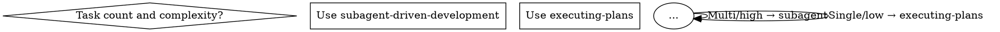

# Implement Spec Skill 重构设计

## Motivation

对 `implement-specs` skill 进行结构化升级，解决两个问题：

1. **禁止 subagent 执行模式** — 当前 Stage 3 允许 agent 自主选择 `subagent-driven-development` 或 `executing-plans`，但从实际效果看 subagent 模式在此场景下弊大于利（详见下文）。
2. **采用 GSD XML 风格结构化编排** — 将 prose 章节改造成语义标签体系，让约束前置、依赖显式化、完成定义可检查。

## 设计原则

- **不改变现有流程逻辑**（Spec → Plan → Review → Execute 四个阶段保持不变）
- **不改变与外部技能的契约**（writing-plans、executing-plans、karpathy-guidelines 的调用方式不变）
- **仅改动结构和 stage 3 的执行策略**

## 方案详解

### Change 1：Stage 3 执行模式改为唯一路径

**现状：**

Stage 3 含一个决策树，允许 agent 根据"任务数量和复杂度"自主选择 subagent 还是直接执行。



**问题：**

- subagent 模式在此场景下导致计划漂移 — 子代理看不到完整的 review 上下文，容易在边界上理解和原计划偏离
- 增加了跨 subagent 的信息传递损耗，经常需要额外回合对齐
- 违背了 implement-specs 的核心原则"不跳过 review gate" — subagent 的独立上下文使其无法感知 Stage 2 review 时做的关键决策
- 用户实际使用反馈验证了这一点：subagent 在 implement-specs 场景下弊大于利

**改为：**

Stage 3 只有一条执行路径：`superpowers:executing-plans`

删除决策树、删除 subagent 相关描述、删除 Red Flags 中关于 subagent 的条目、删除 Preferred 声明。

### Change 2：采用 GSD 结构标签

将当前 SKILL.md 的 prose 章节结构改造为语义标签块。

#### 2.1 增加 `<execution_context>` — 依赖前置

当前依赖关系写在底部 Integration 段，agent 读到那里时已经快要执行了。前置后 agent 在读取技能前部时就知道需要哪些子技能。

**内容：**

```markdown
<execution_context>
Required:
- superpowers:writing-plans (Stage 1 — plan generation)
- superpowers:executing-plans (Stage 3 — task execution)
- karpathy-guidelines (all stages — think, surgical, goal-driven)

Also:
- superpowers:using-git-worktrees (isolated workspace)
- superpowers:test-driven-development (test-first within stages)
</execution_context>
```

#### 2.2 增加 `<process>` — 流水线定义

把 Pipeline 部分从 prose + dot 图改为结构化的 `<process>` 块，三阶段列出，让 agent 读到的是指令而非描述。

**内容：**

```markdown
<process>
Execute these stages in strict order. Each stage is a hard gate — do not proceed until the current stage is complete.

### Stage 1: Write Plan
1. Invoke `superpowers:writing-plans` with the spec as input
2. Apply karpathy-guidelines: surface assumptions, ask before guessing, design minimum viable path
3. Save plan to disk — do NOT proceed until plan file exists

### Stage 2: Review Plan
1. Run the 10-point review checklist against the plan and original spec
2. If ANY check fails: fix the plan inline, re-review
3. Only when all checks pass → proceed to Stage 3

### Stage 3: Execute Plan
1. Load the reviewed plan
2. Invoke `superpowers:executing-plans`
3. Execute tasks in order, exactly as specified
4. Run verification command after each task before marking complete
5. Stop when blocked — do not skip, reorder, or batch tasks
</process>
```

#### 2.3 增加 `<critical_rules>` — 硬约束区

当前 Red Flags 和 Anti-Rationalization 表是分开的。用 `<critical_rules>` 把真正的硬墙提炼出来，放在最前面。

**内容：**

```markdown
<critical_rules>
- Never write code before the plan exists on disk
- Never start execution before Stage 2 review passes
- Never skip the plan review — the user seeming "impatient" is not a valid reason
- Never accept placeholders (TBD, TODO) in the plan
- Never proceed with ambiguous requirements — ask before guessing
- Never touch code outside the scope of the current task
- Never mark a task complete without running its verification step
- Never add features, abstractions, or "nice-to-haves" not in the spec
- Never refactor or reformat code your changes didn't touch
</critical_rules>
```

#### 2.4 增加 `<success_criteria>` — 完成定义

当前完成标准分散在 Stage 2 的 10 项检查表里。提炼为技能前部的全局成功标准。

**内容：**

```markdown
<success_criteria>
- Plan covers every spec requirement with no gaps
- Review checklist: all 10 checks pass before execution
- Each task has a verifiable success criterion with explicit verification command
- All verification commands pass before the task is marked complete
- No scope creep — only what the spec asked for has been implemented
</success_criteria>
```

### Change 3：Anti-Rationalization 表 + Red Flags 精简

不再需要关于 subagent 的条目：

- Anti-Rationalization 表删除以下条目：
  - `"Subagent is overkill"`（不再涉及 subagent）
  - `"直接执行太简单了"` → `"I'll just run it directly"`（subagent 相关对比不再适用）

- Red Flags 删除以下条目：
  - `"Executing directly when subagent support is available"`
  - `"Skipping two-stage review in subagent mode"`

保留其他所有条目。

### Change 4：Integration 段精简

删除 subagent 相关的声明：

- 删除 "**Preferred:** `superpowers:subagent-driven-development` (Stage 3)"
- Stage 3 改为：`superpowers:executing-plans`（Required 列表中已有）

## 不涉及的部分

以下内容结构保持不变：

- The Pipeline dot 图（可保留或删除，由实现决定）
- Stage 2 的 10 项 Review 检查表（内容不变，位置不变）
- 剩下的 Anti-Rationalization 条目（不变）
- 剩下的 Red Flags 条目（不变）
- Overview 段落（可微调措辞，但定位不变）

## 最终结构骨架

```markdown
---
name: implement-specs
description: ...
---

<objective>
一句话定义：从 spec 到实现的全流程编排
</objective>

<execution_context>
子技能依赖清单
</execution_context>

<critical_rules>
硬约束 9 条
</critical_rules>

<success_criteria>
验收标准
</success_criteria>

<process>
三阶段流水线定义
</process>

## Pipeline Diagram (保留或删除)

## Stage 2 Review Checklist (10 项检查)

## Anti-Rationalization 表 (精简版)

## Red Flags (精简版)

## Integration (精简版)
```

## 验证标准

1. 技能被加载后，agent 不会选择 subagent-driven-development
2. `<execution_context>` 出现在技能前部，agent 第一眼就能看到依赖
3. `<critical_rules>` 内容准确反映不可违反的硬约束
4. 所有 subagent 相关的引用被完全移除
5. 所有现有的流程门禁（review gate、verify-before-complete 等）保持不变
