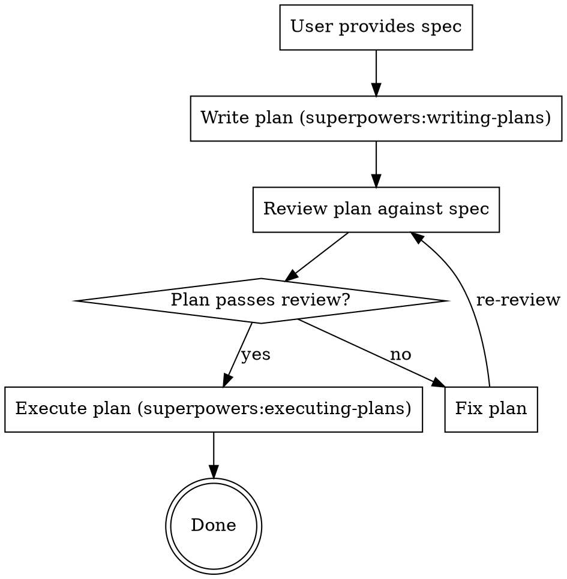
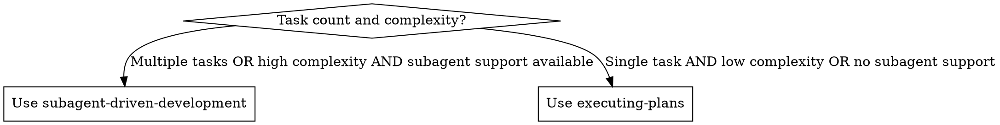

# Implement Spec

## Overview

Orchestrate the full pipeline from spec to working implementation: plan, review, execute. **Never skip a stage.** Each stage is a hard gate.

**Core principle:** Spec → Plan → Review → Execute. Zero shortcuts.

**Announce:** "Using implement-spec to plan, review, and implement."

## The Pipeline

## Stage 1: Write Plan

**REQUIRED SUB-SKILL:** Use `superpowers:writing-plans`

**REQUIRED:** Apply `karpathy-guidelines` when planning:
- **Think Before Coding:** State assumptions about the spec explicitly. If something is ambiguous, ask before planning — don't bake guesses into the plan.
- **Simplicity First:** Design the minimum viable path. No tasks for speculative features, premature abstractions, or "nice-to-have" extras not in the spec.
- **Goal-Driven:** Each task must have a verifiable success criterion. "Implement X" is not enough — "Implement X, verify with `npm test -- X.spec.ts`" is.

Read the spec, create the plan at the configured path, run the Self-Review from `writing-plans`. **Do NOT proceed until the plan is saved to disk.**

## Stage 2: Review Plan

Explicit review of the written plan against the original spec — not a mental check.

| Check | Verify |
|-------|--------|
| Spec coverage | Every requirement maps to a task |
| No placeholders | No TBD, TODO, or vague steps |
| Type consistency | Names and types match across tasks |
| Task independence | Each task is verifiable and self-contained |
| Test strategy | Explicit commands with expected output |
| Dependencies | Later tasks show files/types from earlier tasks |
| File paths | All paths exact and consistent |
| **Simplicity check** | **No tasks for unrequested features or premature abstractions** |
| **Assumption check** | **Ambiguities were surfaced and resolved, not silently guessed** |
| **Goal clarity** | **Each task has explicit verification steps, not just "make it work"** |

**If ANY check fails:** Fix inline. Do NOT execute a broken plan.

**Time pressure is NOT a valid reason to skip this stage.**

## Stage 3: Execute Plan

**REQUIRED:** Apply `karpathy-guidelines` when executing:
- **Think Before Coding:** Before each task, state assumptions about the current codebase state.
- **Surgical Changes:** Touch only code required by the task. Don't "improve" adjacent code or formatting.
- **Goal-Driven:** Execute the task's verification step before marking it complete. No "looks good" — prove it.

**Choose execution mode autonomously.** Do NOT ask the user which mode to use. Decide based on:

Load the reviewed plan, execute tasks in order, follow steps exactly, run verifications, stop when blocked.

## Anti-Rationalization

| Excuse | Reality |
|--------|---------|
| "Spec is simple, no plan needed" | Simple specs still need file mapping and task order |
| "I mentally reviewed it" | Mental review misses placeholders and type mismatches |
| "User is waiting, skip review" | 2-minute review beats 20-minute rework |
| "I'll fix issues as I go" | Missing files mid-execution = context pollution + rework |
| "Tests after achieve same goal" | Tests prove code works; review proves plan is correct |
| "Plan Self-Review is enough" | Self-Review checks plan quality; Stage 2 checks spec alignment |
| "writing-plans auto-executes" | Override auto-execution. Insert explicit review gate. |
| "Subagent is overkill" | Fresh context per task prevents cross-task pollution and reduces errors |
| "I'll just run it directly" | Direct execution burns context and increases rationalization risk |
| "加个配置选项更灵活" | Unrequested flexibility violates Simplicity First. Add only what the spec asks. |
| "顺手重构一下相邻代码" | Surgical Changes: only touch code directly required by the task. Mention dead code, don't delete it. |
| "这个假设很明显，不需要问" | Think Before Coding: obvious to you ≠ obvious to others. Surface all assumptions explicitly. |
| "先写代码，测试后面补" | Goal-Driven: every task needs verification before it's done. "Tests after" = unverified code. |
| "200行代码能实现，但50行太丑了" | Simplicity First: if it solves the problem in 50 lines, use 50. Elegance ≠ complexity. |

## Red Flags — STOP

- Writing code before plan exists on disk
- Starting Task 1 before review is complete
- "Close enough" on spec coverage
- Skipping review because "user seems impatient"
- Proceeding with placeholders in the plan
- Executing directly when subagent support is available
- Skipping two-stage review in subagent mode
- Designing tasks for features not in the spec
- Proceeding with ambiguous requirements instead of asking
- Deleting or refactoring code your changes didn't touch
- Marking a task complete without running its verification step
- "Improving" code style or structure unrelated to the current task

## Integration

**Required:** `superpowers:writing-plans` (Stage 1), `superpowers:executing-plans` (Stage 3), `karpathy-guidelines` (all stages)
**Preferred:** `superpowers:subagent-driven-development` (Stage 3)
**Also:** `superpowers:using-git-worktrees`, `superpowers:test-driven-development`
