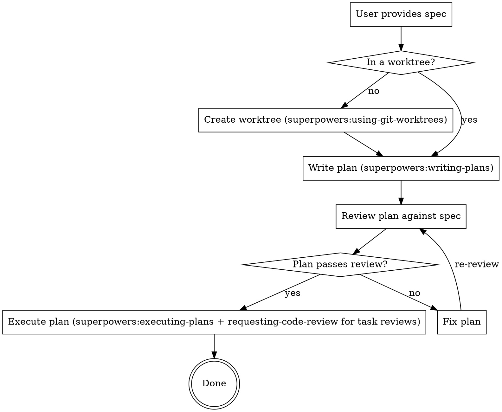

# Implement Specs

<objective>
Orchestrate the full pipeline from spec to working implementation: isolate, plan, review, execute. **Never skip a stage.** Each stage is a hard gate.

**Core principle:** Worktree → Plan → Review → Execute (in this session, review via subagents). Zero shortcuts.

**Announce:** "Using implement-specs to isolate, plan, review, and implement in this session with subagent reviews."
</objective>

<execution_context>
Required:
- superpowers:using-git-worktrees (Stage 0 — isolated workspace)
- superpowers:writing-plans (Stage 1 — plan generation)
- superpowers:executing-plans (Stage 3 — task execution in this session)
- superpowers:requesting-code-review (Stage 3 — task-level and final review via subagents)
- karpathy-guidelines (all stages — think, surgical, goal-driven)

Also:
- superpowers:test-driven-development (test-first within stages)
- superpowers:finishing-a-development-branch (complete the branch after all tasks)
</execution_context>

<critical_rules>
- Never write a plan or code in the main checkout — work in an isolated worktree (create one if not already in it)
- Never write code before the plan exists on disk
- Never start execution before Stage 2 review passes
- Never skip the plan review — the user seeming "impatient" is not a valid reason
- Never accept placeholders (TBD, TODO) in the plan
- Never proceed with ambiguous requirements — ask before guessing
- Never touch code outside the scope of the current task
- Never mark a task complete without running its verification step
- Never add features, abstractions, or "nice-to-haves" not in the spec
- Never refactor or reformat code your changes didn't touch
</critical_rules>

<success_criteria>
- Implementation happens in an isolated worktree, never the main checkout
- Plan covers every spec requirement with no gaps
- Review checklist: all 10 checks pass before execution
- Tasks are independent enough to execute one at a time in this session, with a review gate after each
- Each task passes either self-review (simple tasks meeting all gate criteria) or reviewer subagent review before it is marked complete
- Simple tasks use the self-review checklist; any doubt escalates to a reviewer subagent
- Each task has a verifiable success criterion with explicit verification command
- All verification commands pass before the task is marked complete
- No scope creep — only what the spec asked for has been implemented
</success_criteria>

<process>
Execute these stages in strict order. Each stage is a hard gate — do not proceed until the current stage is complete.

### Stage 0: Isolated Workspace
1. Invoke `superpowers:using-git-worktrees` to ensure an isolated workspace
2. If already inside a linked worktree (its Step 0 detection) → continue working there
3. If NOT in a worktree → a worktree is REQUIRED. Create one. In this pipeline, working directly in the main checkout is not an option — do NOT proceed to Stage 1 until an isolated workspace exists
4. All plan files and code changes from later stages happen inside this workspace

### Stage 1: Write Plan
1. Invoke `superpowers:writing-plans` with the spec as input
2. Apply karpathy-guidelines: surface assumptions, ask before guessing, design minimum viable path
3. Save plan to disk — do NOT proceed until plan file exists

### Stage 2: Review Plan
1. Run the 10-point review checklist against the plan and original spec
2. If ANY check fails: fix the plan inline, re-review
3. Only when all checks pass → proceed to Stage 3

### Stage 3: Execute Plan
1. Load the reviewed plan
2. Invoke `superpowers:executing-plans` for the current session: mark tasks in_progress, follow each step exactly, run verifications, and commit per task
3. After each task's verification passes, run the review complexity gate (file count, diff size, API/state/concurrency/permissions/error-handling involvement)
4. Simple tasks that pass the gate → self-review checklist; mark complete if all checks pass, otherwise escalate to reviewer subagent
5. Complex tasks or escalations → generate a review package, extract a task brief, and dispatch a reviewer subagent (use `superpowers:requesting-code-review` / `../requesting-code-review/code-reviewer.md`)
6. If the reviewer reports Critical/Important findings: fix them in this session (or dispatch a fix subagent for complex fixes), re-run verifications, regenerate the review package, and re-dispatch the reviewer
7. Mark the task complete in the todo list and progress ledger only when review passes
8. After all tasks complete, generate a whole-branch review package and dispatch the final reviewer
9. Use `superpowers:finishing-a-development-branch` to complete the work
</process>

## Pipeline

## Stage 0: Isolated Workspace

**REQUIRED SUB-SKILL:** Use `superpowers:using-git-worktrees`

Run its Step 0 detection first:
- **Already in a linked worktree** → continue there. Do not create another.
- **In a normal checkout (not a worktree)** → a worktree is **REQUIRED** for this pipeline. Create one and move into it before writing any plan or code.

**This overrides the default "ask for consent / work in place" behavior of `using-git-worktrees`.** In implement-specs, the isolated workspace is a hard gate: planning and implementation must not touch the main checkout. The only way to skip creation is to already be inside a worktree.

## Stage 1: Write Plan

**REQUIRED SUB-SKILL:** Use `superpowers:writing-plans`

**REQUIRED:** Apply `karpathy-guidelines` when planning:
- **Think Before Coding:** State assumptions about the spec explicitly. If something is ambiguous, ask before planning — don't bake guesses into the plan.
- **Simplicity First:** Design the minimum viable path. No tasks for speculative features, premature abstractions, or "nice-to-have" extras not in the spec.
- **Goal-Driven:** Each task must have a verifiable success criterion. "Implement X" is not enough — "Implement X, verify with `npm test -- X.spec.ts`" is.

Read the spec, create the plan at the configured path, run the Self-Review from `writing-plans`. **Do NOT proceed until the plan is saved to disk.**

## Stage 2: Review Plan

Explicit review of the written plan against the original spec — not a mental check.

| Check | Verify |
|-------|--------|
| Spec coverage | Every requirement maps to a task |
| No placeholders | No TBD, TODO, or vague steps |
| Type consistency | Names and types match across tasks |
| Task independence | Each task is verifiable and self-contained |
| Test strategy | Explicit commands with expected output |
| Dependencies | Later tasks show files/types from earlier tasks |
| File paths | All paths exact and consistent |
| **Simplicity check** | **No tasks for unrequested features or premature abstractions** |
| **Assumption check** | **Ambiguities were surfaced and resolved, not silently guessed** |
| **Goal clarity** | **Each task has explicit verification steps, not just "make it work"** |

**If ANY check fails:** Fix inline. Do NOT execute a broken plan.

**Time pressure is NOT a valid reason to skip this stage.**

## Stage 3: Execute Plan

**REQUIRED:** Apply `karpathy-guidelines` when executing:
- **Think Before Coding:** Before each task, state assumptions about the current codebase state.
- **Surgical Changes:** Touch only code required by the task. Don't "improve" adjacent code or formatting.
- **Goal-Driven:** Execute the task's verification step before marking it complete. No "looks good" — prove it.

**REQUIRED SUB-SKILL:** Use `superpowers:executing-plans` to run each task in this session.

For each task:
1. Mark it `in_progress`.
2. Execute the task steps in the current session, exactly as written in the plan.
3. Run the verification command and confirm it passes.
4. Commit the task's changes.
5. **Review complexity gate:** decide whether this task qualifies for self-review or needs a reviewer subagent. **All** of the following must be true for self-review:
   - Touches **≤ 3 files**.
   - Net diff is **≤ 30 lines** (`git diff --stat` total).
   - No API / interface / signature changes.
   - No state management, concurrency, permissions, or error-handling changes.
   - One clear verification command covers the change.
   
   **If any condition is false → use reviewer subagent.**
   **If you are unsure whether a condition is met → use reviewer subagent.**

6. **Self-review path (simple tasks only):**
   - Run the self-review checklist against the diff and task brief:
     1. Does this diff fully cover the task brief's requirements?
     2. Are there any changes not requested by the plan?
     3. Are there TBD/TODO comments, hard-coded values, or magic numbers?
     4. Does the verification actually test behavior, not just existence?
     5. Are obvious edge cases handled?
   - If **all** questions have clear, positive answers → mark the task complete.
   - If **any** question raises doubt → escalate to reviewer subagent.

7. **Subagent review path (complex tasks or escalation):**
   - Generate a review package for this task using `../subagent-driven-development/scripts/review-package BASE HEAD` (record `BASE` before you start the task; use the printed review-package file path).
   - Extract a task brief using `../subagent-driven-development/scripts/task-brief PLAN_FILE N` so the reviewer can read the requirements without the full plan.
   - Dispatch a reviewer subagent using `superpowers:requesting-code-review` / `../requesting-code-review/code-reviewer.md`. Give it the brief path, the review package path, and the plan's Global Constraints.
   - If the reviewer reports Critical or Important findings, fix them in this session (or dispatch a fix subagent if the fix is large or cross-cutting), re-run the verification, regenerate the review package, and re-dispatch the reviewer.
   - Only mark the task complete when the reviewer approves.

8. Record progress in the ledger: `Task N: complete (commits <base7>..<head7>, review clean)`.

After all tasks:
- Generate a whole-branch review package (`../subagent-driven-development/scripts/review-package MERGE_BASE HEAD`).
- Dispatch the final reviewer subagent.
- Address any findings.
- Use `superpowers:finishing-a-development-branch` to complete the branch.

**Prerequisite:** This skill assumes tasks are mostly independent (that is what the Task independence check in Stage 2 enforces). If the plan's tasks are tightly coupled, resolve that in the plan before reaching this stage.

## Anti-Rationalization

| Excuse | Reality |
|--------|---------|
| "Just work in the main checkout, a worktree is overkill" | Stage 0 is a hard gate. If not already in a worktree, create one — implementation never touches the main checkout. |
| "Spec is simple, no plan needed" | Simple specs still need file mapping and task order |
| "I mentally reviewed it" | Mental review misses placeholders and type mismatches |
| "User is waiting, skip review" | 2-minute review beats 20-minute rework |
| "I'll fix issues as I go" | Missing files mid-execution = context pollution + rework. Use the task review gate. |
| "Tests after achieve same goal" | Tests prove code works; review proves plan is correct |
| "Plan Self-Review is enough" | Self-Review checks plan quality; Stage 2 checks spec alignment |
| "writing-plans auto-executes" | Override auto-execution. Insert explicit review gate. |
| "I'll just run it directly" | Follow the reviewed plan through `superpowers:executing-plans`; don't bypass the execution gate |
| "这个任务看起来简单，我自己 review 就行" | 用硬性 complexity gate 判断；不确定时默认走 reviewer subagent |
| "加个配置选项更灵活" | Unrequested flexibility violates Simplicity First. Add only what the spec asks. |
| "顺手重构一下相邻代码" | Surgical Changes: only touch code directly required by the task. Mention dead code, don't delete it. |
| "这个假设很明显，不需要问" | Think Before Coding: obvious to you ≠ obvious to others. Surface all assumptions explicitly. |
| "先写代码，测试后面补" | Goal-Driven: every task needs verification before it's done. "Tests after" = unverified code. |
| "200行代码能实现，但50行太丑了" | Simplicity First: if it solves the problem in 50 lines, use 50. Elegance ≠ complexity. |

## Red Flags — STOP

- Writing a plan or code in the main checkout instead of an isolated worktree
- Skipping worktree creation because "it's a small change"
- Writing code before plan exists on disk
- Starting Task 1 before review is complete
- "Close enough" on spec coverage
- Skipping review because "user seems impatient"
- Proceeding with placeholders in the plan
- Designing tasks for features not in the spec
- Proceeding with ambiguous requirements instead of asking
- Deleting or refactoring code your changes didn't touch
- Marking a task complete without running its verification step
- "Improving" code style or structure unrelated to the current task

## Integration

**Required:** `superpowers:using-git-worktrees` (Stage 0), `superpowers:writing-plans` (Stage 1), `superpowers:executing-plans` (Stage 3 execution in this session), `superpowers:requesting-code-review` (Stage 3 task/final review via subagents), `superpowers:finishing-a-development-branch` (complete the branch), `karpathy-guidelines` (all stages)
**Also:** `superpowers:test-driven-development`
