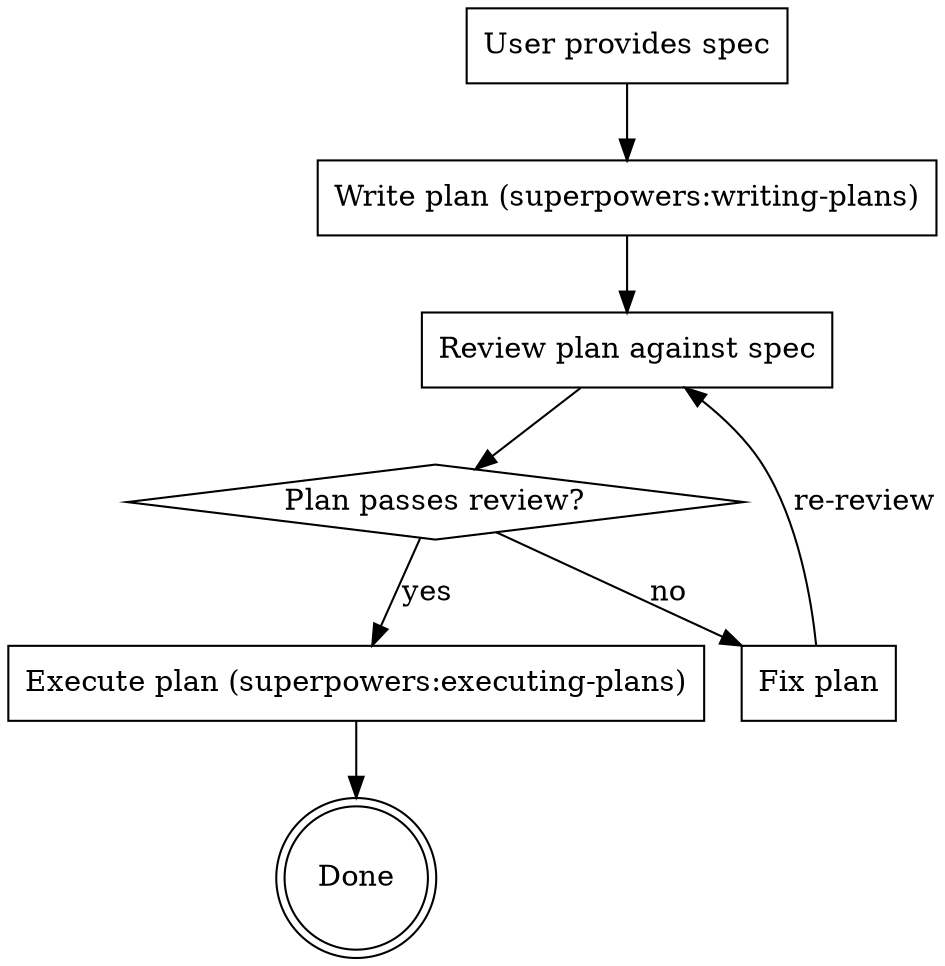

# Spec to Execution

## Overview

Orchestrate the full pipeline from spec to working implementation: plan, review, execute. **Never skip a stage.** Each stage is a hard gate.

**Core principle:** Spec → Plan → Review → Execute. Zero shortcuts.

**Announce:** "Using spec-to-execution to plan, review, and implement."

## The Pipeline

## Stage 1: Write Plan

**REQUIRED SUB-SKILL:** Use `superpowers:writing-plans`

Read the spec, create the plan at the configured path, run the Self-Review from `writing-plans`. **Do NOT proceed until the plan is saved to disk.**

## Stage 2: Review Plan

Explicit review of the written plan against the original spec — not a mental check.

| Check | Verify |
|-------|--------|
| Spec coverage | Every requirement maps to a task |
| No placeholders | No TBD, TODO, or vague steps |
| Type consistency | Names and types match across tasks |
| Task independence | Each task is verifiable and self-contained |
| Test strategy | Explicit commands with expected output |
| Dependencies | Later tasks show files/types from earlier tasks |
| File paths | All paths exact and consistent |

**If ANY check fails:** Fix inline. Do NOT execute a broken plan.

**Time pressure is NOT a valid reason to skip this stage.**

## Stage 3: Execute Plan

**REQUIRED SUB-SKILL:** Use `superpowers:executing-plans`

Load the reviewed plan, execute tasks in order, follow steps exactly, run verifications, stop when blocked.

## Anti-Rationalization

| Excuse | Reality |
|--------|---------|
| "Spec is simple, no plan needed" | Simple specs still need file mapping and task order |
| "I mentally reviewed it" | Mental review misses placeholders and type mismatches |
| "User is waiting, skip review" | 2-minute review beats 20-minute rework |
| "I'll fix issues as I go" | Missing files mid-execution = context pollution + rework |
| "Tests after achieve same goal" | Tests prove code works; review proves plan is correct |
| "Plan Self-Review is enough" | Self-Review checks plan quality; Stage 2 checks spec alignment |
| "writing-plans auto-executes" | Override auto-execution. Insert explicit review gate. |

## Red Flags — STOP

- Writing code before plan exists on disk
- Starting Task 1 before review is complete
- "Close enough" on spec coverage
- Skipping review because "user seems impatient"
- Proceeding with placeholders in the plan

## Integration

**Required:** `superpowers:writing-plans` (Stage 1), `superpowers:executing-plans` (Stage 3)
**Also:** `superpowers:using-git-worktrees`, `superpowers:test-driven-development`
**Subagent platforms:** `superpowers:subagent-driven-development` (Stage 3)
